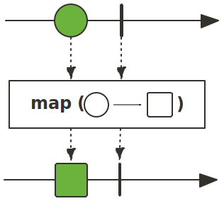
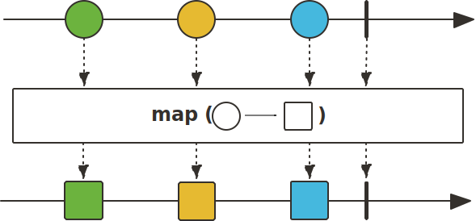
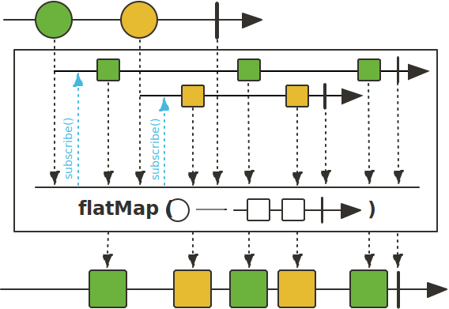
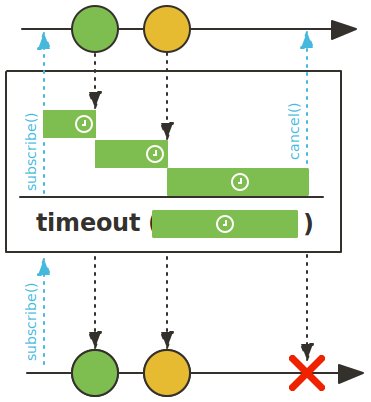
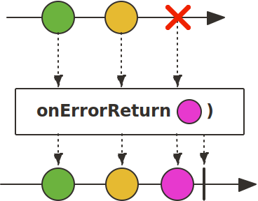

# Part 1: Reactive operators
## Exercise Mono subscribe()
The subscribe method is not a reactive operator, it will actually execute your reactive statement.
It is possible to pass a Consumer (or Lambda, since Consumer is a Functional interface) to the subscribe method.
Then, the consumer can handle the outputs from the reactive statement. Since we subscribe to a Mono, the consumer is called 0 or 1 time.

This example will print "Hello World!":
```java
Mono.just("Hello World!").subscribe(value -> System.out.println(value));
```

Now try this yourself by making the nl.trifork.coins.ReactiveOperatorsTest.subscribeShouldCallConsumer1time test succeed!

## Exercise Flux subscribe()
The subscribe method is not a reactive operator, it will actually execute your reactive statement.
It is possible to pass a Consumer (or Lambda, since Consumer is a Functional interface) to the subscribe method.
Then, the consumer can handle the outputs from the reactive statement. Since we subscribe to a Flux, the consumer is called 0 or n times.

This example will print "Hello World!", "Hello Mars!":
```java
Flux.just("Hello World!", "Hello Mars!").subscribe(value -> System.out.println(value));
```

Now try this yourself by making the nl.trifork.coins.ReactiveOperatorsTest.subscribeShouldCallConsumer10times test succeed!

## Exercise Mono map()
The Mono map operator transforms items with the help of a synchronous function.



This example will print "A":
```java
Mono.just(1).map(i -> "A").subscribe(value -> System.out.println(value));
```

Now try this yourself by making the nl.trifork.coins.ReactiveOperatorsTest.mapShouldConvertIntToString test succeed!

## Exercise Flux map()
The Flux map operator transforms items with the help of a synchronous function.



This example will print "A","B","C":
```java
 Flux.just(0,1,2).map(i -> array("A","B","C")[i]).subscribe(value -> System.out.println(value));
```
Now try this yourself by making the nl.trifork.coins.ReactiveOperatorsTest.mapShouldConvertIntsToStrings test succeed!

## Exercise Flux map() with method reference
The map operator can take a function reference as parameter.


This example will print "A","B","C":
```java
Flux.just(0,1,2).map(this::transformToLetters).subscribe(value -> System.out.println(value));

private String transformToLetters(int i){
    return array("A","B","C")[i];
}

```

Now try this yourself by making the nl.trifork.coins.ReactiveOperatorsTest.mapShouldCalculateValues test succeed!

## Exercise Flux flatMap()
The Flux flatMap operator transforms items with the help of a asynchronous function.



This example will print "A","B","C":
```java
Flux.just(0,1,2).flatMap(this::transformToLettersAsync).subscribe(value -> System.out.println(value));

private Flux<String> transformToLetters(int i){
    return externalWebServiceCallToTransformToLetters(i);
}

```

Now try this yourself by making the nl.trifork.coins.ReactiveOperatorsTest.flatMapShouldCalculateValuesAsync test succeed!

## Exercise Flux filter()
The Flux filter operator filters only items that match the predicate, the predicate can be implemented with a lambda function.


This example will print "hello","world"
```java
Flux.just("banana","hello","strawberry","world").filter(word -> word.length()==5).subscribe(value -> System.out.println(value));
```

Now try this yourself by making the nl.trifork.coins.ReactiveOperatorsTest.filterShouldOnlyPrintEventNumbers test succeed!


## Exercise Flux timeout()
When the is no item emitted within the given time, the timeout() operator will emit a TimeoutException.



This example will print the error message "Did not observe any item or terminal signal within 1000ms in 'source(FluxNever)' (and no fallback has been configured)", because Flux.never() never emits an item.
Notice the second lambda function passed to subscribe. The second function will be called when an exception occurred.

```java
Flux.never().timeout(Duration.ofSeconds(1)).subscribe(value -> System.out.println(value), error-> System.out.println(error.getMessage()));
```

Now try this yourself by making the nl.trifork.coins.ReactiveOperatorsTest.timeoutShouldThrowException test succeed!

## Exercise Flux onErrorReturn
OnErrorReturn emits a predefined value when there is an exception.



This example will print "Hello World!":

```java
Flux.error(new RuntimeException()).onErrorReturn("Hello World!").subscribe(value -> System.out.println(value));
```

Now try this yourself by making the nl.trifork.coins.ReactiveOperatorsTest.timeoutShouldReturnDefaultValue test succeed!


# Part 2: Applying reactive programming
Now that you know several reactive programming operators, it is time to apply them to our CQRS/ES context.

This example with print "SUCCESS":
```java
 Flux.just("STARTED","PENDING","SUCCESS")
                .doOnEach(value -> System.out.println(value))
                .filter(value -> "SUCCESS".equals(value))
                .timeout(ofSeconds(1))
                .next()
                .onErrorReturn("ERROR")
                .subscribe(consumer);
        verify(consumer, timeout(1100)).accept(eq("SUCCESS"));
```

And this example will print "ERROR"

```java
Flux.<String>generate(sink -> sink.next("STARTED")).take(5).delayElements(ofMillis(500)) //emit "STARTED" 5 times every 500 ms.
                .doOnEach(value -> System.out.println(value))
                .filter(value -> "SUCCESS".equals(value))
                .timeout(ofSeconds(1))
                .next()
                .onErrorReturn("ERROR")
                .subscribe(consumer);
        verify(consumer, timeout(1000)).accept(eq("ERROR"));
```

Make the nl.trifork.coins.restfacade.controller.OrderControllerTest succeed by implementing the missing operators in nl.trifork.coins.restfacade.controller.OrderController.executeOrder.


